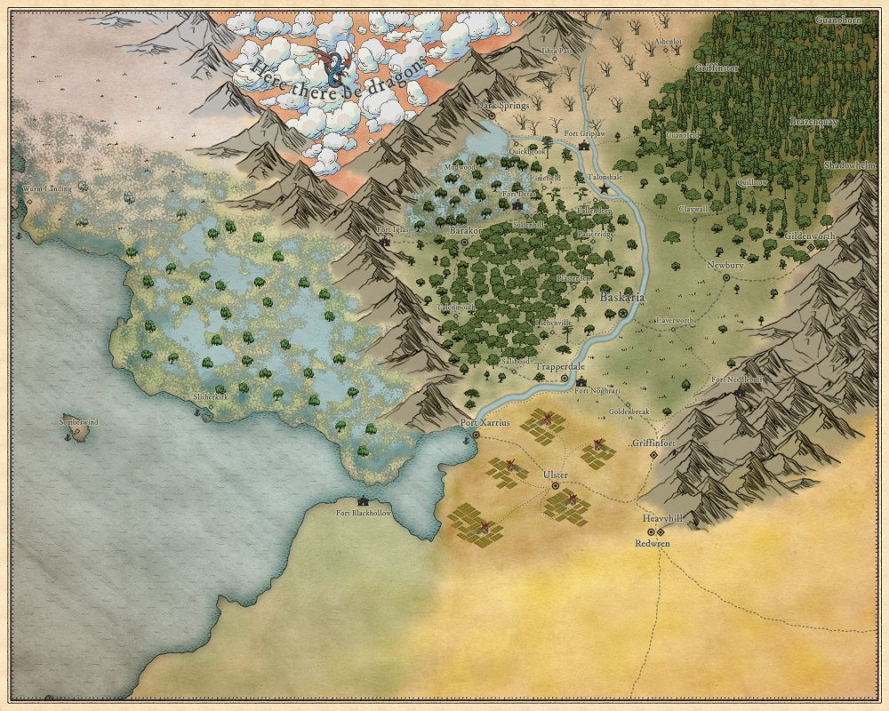

# Zemljevid
Spodaj je zemljevid znanih in neznanih pokrajin, znan našim herojem. Klikni na sliko za fullscreen zemljevid.

## Kraljestva in regije
Imena v oklepajih so imena, ki jih uporabljajo nativni prebivalci in načeloma niso znana Tessalončanom, torej tudi igralcem ne.

* Kingdom of Tessalonia
  * Baskaria
  * The Plains
  * Forest of Barakor
  * Detas Marches
* Ulster Satrapy
  * Ulster Fields
  * Port Xarrius
  * Harringate University
* Dwarfen kingdom (Durimmear Kingdom)
  * Cressend Mountains (Durimmear Peaks)
* Plemena divjakov (niso združena, zato ima vsako pleme svoje ime)
  * Boor Woods
  * The Iron Tops
* Drow Tribes (Children of Dardaroth)
  * Dunes of Langsard (Shifting Sand)
* Blaintou Highlands, here there be dragons
* No Man's Land
  * West Marches
  * The North
  * The Wastes of Arkensaw

